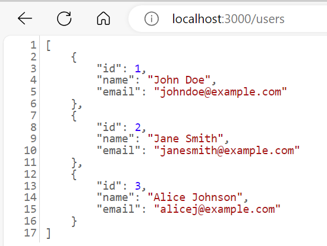
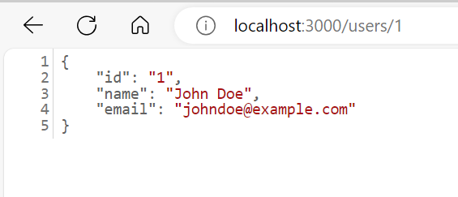
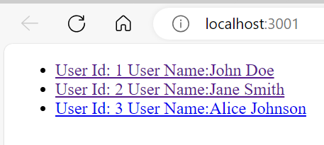
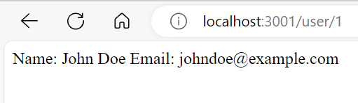
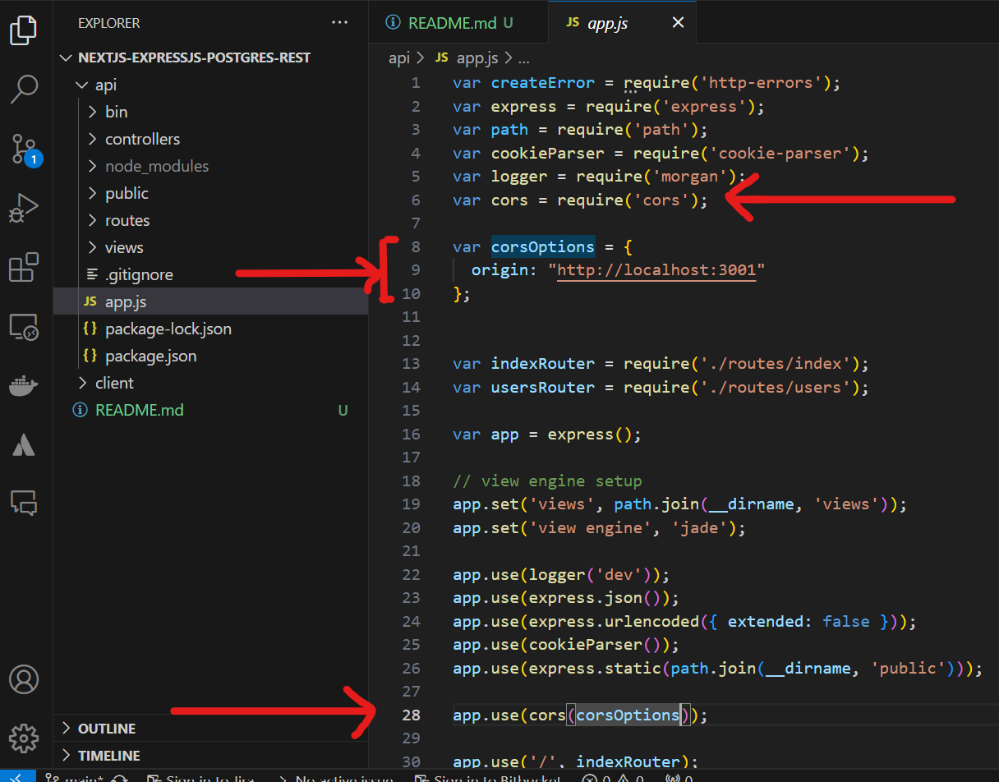
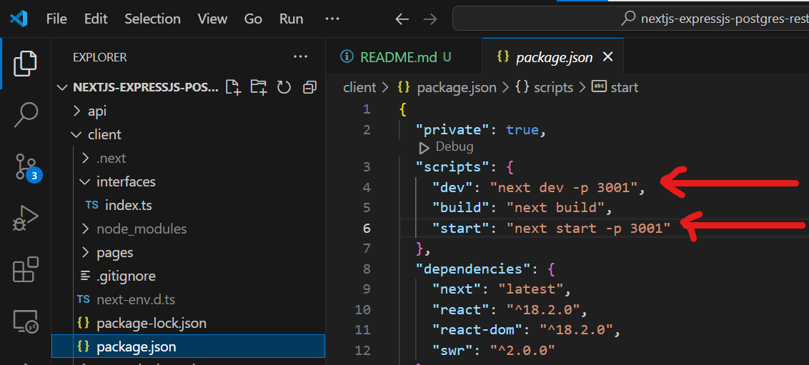

# nextjs-expressjs-restapi

## How to run it
### To run api (backend)
```bash
# This is a Bash code block
cd api
npm install
npm start #It will start api (backend) at localhost, port 3000
```
You should see something like this






### To run client (frontend)
```bash
# This is a Bash code block
cd client
pnpm run dev #It will start client (frontend) at localhost, port 3001
```

You should see something like this:





## How to create it

### Create Express Api App

```bash
npx express-generator api
cd api
```

1. Add controllers directory under api and add user.controller.js under controllers

api/controllers/user.controller.js
```js
// Mockup controller for Users

// Create and Save a new User (Mockup)
exports.create = (req, res) => {
    const user = {
      id: Math.floor(Math.random() * 1000), // Generate a random user ID
      name: req.body.name || "John Doe", // Default name if none is provided
      email: req.body.email || "johndoe@example.com", // Default email if none is provided
    };
  
    res.status(201).send({
      message: "User created successfully!",
      user: user
    });
  };
  
  // Retrieve all Users (Mockup)
  exports.findAll = (req, res) => {
    const users = [
      { id: 1, name: "John Doe", email: "johndoe@example.com" },
      { id: 2, name: "Jane Smith", email: "janesmith@example.com" },
      { id: 3, name: "Alice Johnson", email: "alicej@example.com" },
    ];
  
    res.status(200).send(users);
  };
  
  // Retrieve a single User by ID (Mockup)
  exports.findOne = (req, res) => {
    const id = req.params.id;
    
    const user = { id: id, name: "John Doe", email: "johndoe@example.com" };
  
    if (parseInt(id) > 0 && parseInt(id) < 1000) {
      res.status(200).send(user);
    } else {
      res.status(404).send({ message: `User with id=${id} not found.` });
    }
  };
  
  // Update a User by ID (Mockup)
  exports.update = (req, res) => {
    const id = req.params.id;
    const updatedUser = {
      id: id,
      name: req.body.name || "Updated User",
      email: req.body.email || "updated@example.com"
    };
  
    res.status(200).send({
      message: `User with id=${id} updated successfully!`,
      user: updatedUser
    });
  };
  
  // Delete a User by ID (Mockup)
  exports.delete = (req, res) => {
    const id = req.params.id;
  
    if (parseInt(id) > 0 && parseInt(id) < 1000) {
      res.status(200).send({
        message: `User with id=${id} was deleted successfully!`
      });
    } else {
      res.status(404).send({
        message: `Cannot delete User with id=${id}. User not found.`
      });
    }
  };
  
  // Delete all Users (Mockup)
  exports.deleteAll = (req, res) => {
    res.status(200).send({
      message: "All users were deleted successfully!"
    });
  };
  
```

2. Add this content to api/routes/users.js

```js
const users = require("../controllers/user.controller.js");

var router = require("express").Router();

// Create a new User
router.post("/", users.create);

// Retrieve all Users
router.get("/", users.findAll);

// Retrieve a single User by id
router.get("/:id", users.findOne);

// Update a User with id
router.put("/:id", users.update);

// Delete a User with id
router.delete("/:id", users.delete);

// Delete all Users
router.delete("/", users.deleteAll);

module.exports = router;
```
### Install CORS

1. In your terminal navigate to the API directory and install the CORS package:
```bash
npm install --save cors
```

2. On your code editor go to the API directory and open the nextjs-expressjs-restapi/api/app.js file.
3. In our index.js, we'll require and use that. Your index.js will look like this:



## Create NEXT client

1. Go to root of project and create app with example pi-routes-rest
```bash
npx create-next-app --example api-routes-rest client
```
2. Add email to user interface in client/interfaces/index.ts


3. Add this text to nextjs-expressjs-restapi/client/pages/index.tsx

```js
import type { User } from "../interfaces";
import useSwr from "swr";
import Link from "next/link";

const fetcher = (url: string) => fetch(`http://localhost:3000${url}`).then((res) => res.json());

export default function Index() {
  const { data, error, isLoading } = useSwr<User[]>("/users", fetcher);
 
  if (error) return <div>Failed to load users</div>;
  if (isLoading) return <div>Loading...</div>;
  if (!data) return null;

  return (
    <ul>
      {data.map((user) => (
        <li key={user.id}>
          <Link href="/user/[id]" as={`/user/${user.id}`}>
            { `User Id: ${user.id}  User Name:${user.name}` ?? `User ${user.id}`}
          </Link>
        </li>
      ))}
    </ul>
  );
}
```

This is what changed:

- specified url to be http://localhost:3000
- change api call from /api/users to /users
- change display of user name from user.name to `User Id: ${user.id}  User Name:${user.name}` so that it displays more details

4. We do same modifications to client/pages/user/[id].tsx as previouse
```js
import type { User } from "../../interfaces";
import { useRouter } from "next/router";
import useSwr from "swr";

const fetcher = (url: string) => fetch(`http://localhost:3000${url}`).then((res) => res.json());

export default function UserPage() {
  const { query } = useRouter();
  const { data, error, isLoading } = useSwr<User>(
    query.id ? `/users/${query.id}` : null,
    fetcher,
  );

  if (error) return <div>Failed to load user</div>;
  if (isLoading) return <div>Loading...</div>;
  if (!data) return null;

  return <div>Name: {data.name} Email: {data.email}</div>;
}
```
5. Finally go to package.json and specify app to start in port 3001


